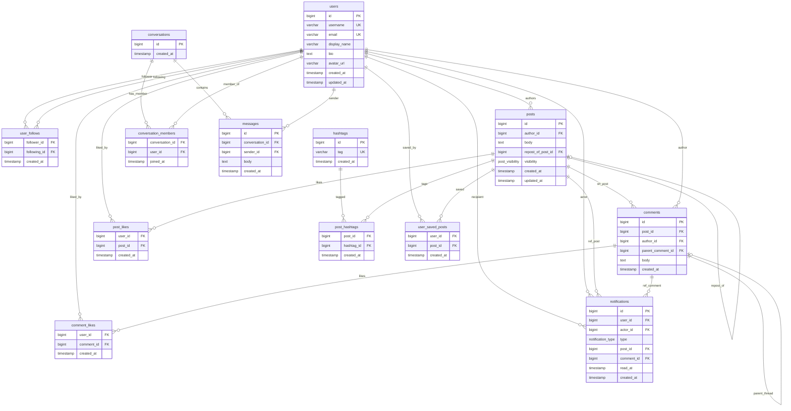

# Database data model (PostgreSQL)

Source of truth: [`backend/docker/postgres-init/01-schema.sql`](../backend/docker/postgres-init/01-schema.sql).

## Enums

| Name | Values |
|------|--------|
| `post_visibility` | `public`, `followers`, `private` |
| `notification_type` | `follow`, `like_post`, `comment`, `mention`, `repost` |

---

## Entity–relationship diagram

### Notes

- **`user_follows`**: composite PK `(follower_id, following_id)`; check `follower_id <> following_id`.
- **`post_likes`**, **`comment_likes`**, **`post_hashtags`**, **`user_saved_posts`**, **`conversation_members`**: composite primary keys on the FK columns shown.
- **`notifications`**: `post_id` and `comment_id` are nullable (e.g. `follow` may omit post/comment).
- **`posts.updated_at` / `users.updated_at`**: maintained by triggers (`trigger_set_updated_at`).
